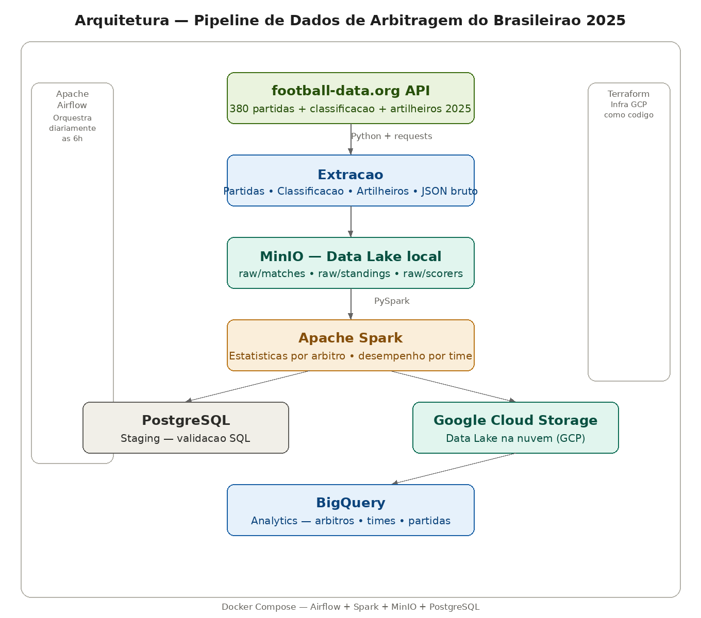

# Brasileirão 2025 — Pipeline de Dados de Arbitragem

Pipeline de dados completo para análise de arbitragem do Campeonato Brasileiro Série A 2025, identificando padrões de árbitros, desempenho de times e estatísticas de partidas.

## Arquitetura



O pipeline segue o fluxo clássico de engenharia de dados em camadas:

**Ingestão:** Python consome a API football-data.org extraindo 380 partidas, classificação e artilheiros do Brasileirão 2025.

**Data Lake local:** Dados brutos armazenados no MinIO antes de qualquer transformação — garantindo reprocessamento a qualquer momento sem chamar a API novamente.

**Transformação:** Apache Spark processa as partidas, calcula estatísticas por árbitro (total de jogos, empates, média de gols) e por time (desempenho em casa vs fora).

**Staging:** Dados carregados no PostgreSQL para validação via SQL antes de ir para a nuvem.

**Data Lake na nuvem:** Arquivos enviados para o Google Cloud Storage.

**Data Warehouse:** Dados disponíveis no BigQuery para queries SQL e analytics.

**Orquestração:** Apache Airflow agenda e monitora todo o pipeline diariamente às 6h.

**Infraestrutura como código:** Toda infraestrutura no GCP provisionada via Terraform.

**Ambiente containerizado:** Airflow, Spark, MinIO e PostgreSQL rodam em Docker Compose.

## Tecnologias

| Tecnologia | Função |
|---|---|
| Python | Extração via API REST |
| Apache Airflow | Orquestração do pipeline |
| Apache Spark (PySpark) | Transformação e estatísticas |
| MinIO | Data Lake local |
| PostgreSQL | Staging e validação |
| Google Cloud Storage | Data Lake na nuvem |
| BigQuery | Data Warehouse analytics |
| Terraform | Infraestrutura como código |
| Docker + Compose | Ambiente containerizado |

## Decisões técnicas

**Por que MinIO antes do GCS?** Dado bruto sempre persistido localmente. Se a API mudar ou ficar fora do ar, o dado original está preservado para reprocessamento.

**Por que Spark?** Mesmo com 380 partidas, a estrutura foi pensada para escalar. A mesma lógica funciona com 380 mil registros sem alterar uma linha de código.

**Por que Airflow?** O campeonato tem rodadas semanais. O pipeline roda automaticamente todo dia e atualiza os dados sem intervenção manual.

## Análise — Árbitros do Brasileirão 2025

Queries disponíveis no BigQuery:

```sql
-- Árbitros por jogos apitados
SELECT referee, total_jogos, empates, media_gols,
  ROUND(empates / total_jogos * 100, 1) as pct_empates
FROM `pipeline-filmes.analytics.brasileirao_arbitros`
ORDER BY total_jogos DESC;

-- Times com melhor desempenho em casa
SELECT time, jogos_casa, gols_marcados_casa, gols_sofridos_casa,
  ROUND(gols_marcados_casa / jogos_casa, 2) as media_gols_casa
FROM `pipeline-filmes.analytics.brasileirao_times`
WHERE jogos_casa > 0
ORDER BY media_gols_casa DESC;

-- Times com melhor desempenho fora
SELECT time, jogos_fora, gols_marcados_fora, gols_sofridos_fora,
  ROUND(gols_marcados_fora / jogos_fora, 2) as media_gols_fora
FROM `pipeline-filmes.analytics.brasileirao_times`
WHERE jogos_fora > 0
ORDER BY media_gols_fora DESC;

-- Partidas com mais gols
SELECT date, home_team, away_team, home_goals, away_goals,
  home_goals + away_goals as total_gols, referee
FROM `pipeline-filmes.analytics.brasileirao_partidas`
ORDER BY total_gols DESC
LIMIT 10;
```

## Como rodar

### 1. Subir o ambiente
```bash
cd docker
docker compose up airflow-init
docker compose up -d
```

### 2. Configurar variáveis
```bash
cp .env.example .env
# Preencha FOOTBALL_API_KEY com sua chave de football-data.org
```

### 3. Criar infraestrutura GCP
```bash
cd terraform
terraform init
terraform apply
```

### 4. Rodar o pipeline
Acesse o Airflow em `http://localhost:8082` e ative a DAG `pipeline_brasileirao`.

## Autor

**Lucas Magalhães** — Engenheiro de Dados

[](https://github.com/lucasmagalhaess)
[](https://linkedin.com/in/lucasmagalhaes-data)
